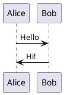

# Diagrams

This section contains PlantUML diagrams and visual documentation for NFRAOPS systems.

## PlantUML Guide

See [PlantUML Guide](plantuml-guide.md) for information on creating and using diagrams in this documentation.

## Diagram Types

- **System Context**: High-level system overviews
- **Component Diagrams**: Detailed component architectures
- **Sequence Diagrams**: Interaction flows between components
- **Deployment Diagrams**: Infrastructure and deployment patterns

## Creating Diagrams

Diagrams are created using PlantUML syntax in markdown files. The `mkdocs-puml` plugin automatically renders these during site build.

Example:

