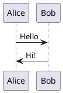
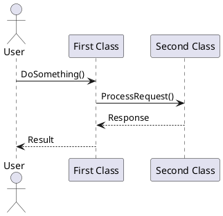
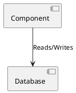
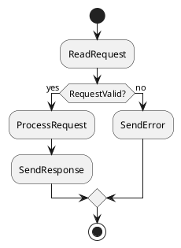

# PlantUML Guide

This guide explains how to create and use PlantUML diagrams in the NFRAOPS documentation.

## What is PlantUML?

PlantUML is a tool that allows you to create diagrams from a simple textual description. It supports various diagram types including:

- Sequence diagrams
- Use case diagrams
- Class diagrams
- Activity diagrams
- Component diagrams
- State diagrams
- Deployment diagrams

## Basic Usage

Diagrams are created using PlantUML syntax in markdown files. The `mkdocs-puml` plugin automatically renders these during site build.

### Example

## Diagram Syntax

### Sequence Diagram

### Component Diagram

### Activity Diagram

## Best Practices

1. **Keep diagrams simple**: Complex diagrams are hard to understand
2. **Use descriptive labels**: Clear labels make diagrams self-documenting
3. **Maintain consistency**: Use similar styling across related diagrams
4. **Document assumptions**: Add notes for complex business logic
5. **Version control**: Text-based diagrams are easy to track in git

## Rendering

The site uses the PlantUML server for rendering. Diagrams are cached for performance.

For local development, ensure you have internet connectivity to reach the PlantUML server.

## Additional Resources

- [PlantUML Language Reference](https://plantuml.com/en/)
- [PlantUML Examples](https://plantuml.com/en/faq)
